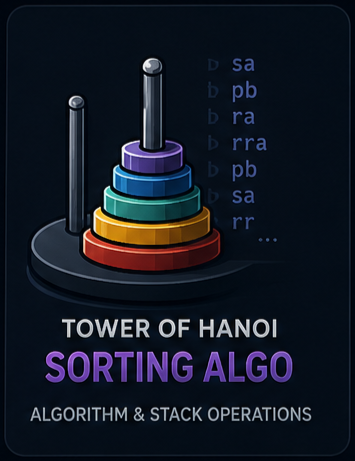

# Tower of Hanoi - Sorting Algo

<p align="center">
  
</p>

## Overview
This project is a `push_swap` implementation: sorting integers using two stacks and a restricted set of operations.
It outputs the sequence of operations needed to sort stack `a` with the fewest moves possible for the chosen strategy.

## Core Concepts Covered
- linked-list stack data structures
- constrained algorithm design
- pivot/chunk-based sorting strategy
- operation primitives (`sa`, `pb`, `ra`, `rra`, etc.)
- input parsing and validation

## Build
From this project directory:

```bash
make
```

## Run
Pass integers as arguments:

```bash
./push_swap 4 2 3 1
```

The program prints the operations to stdout.

## Notes
- If input is already sorted, output is minimal or empty.
- Invalid or duplicate input is filtered by the parser/validation flow.
